<div align="center">
  
</div>

<br/>

<table width="100%">
<tr>
<td width="64%" valign="top">

### `scan_result.log`

```
[INFO]  subject............ chemistry degree, repurposed
[INFO]  current role....... Data Scientist @ SpectrifyAI
[INFO]  input signal....... near-infrared reflectance, 900–1700nm
[INFO]  output.............. polyphenols · theaflavin · caffeine · moisture
[INFO]  deployment target... handheld spectrometers, multi-device fleet
[OK]    validation......... repeated stratified CV, group-aware splits
[OK]    honesty check...... reports the real ceiling, not the flattering one
[STATUS] seeking............ data science roles, Europe
```

I didn't start in code — I started in a lab, running the same reaction until I trusted the result. That instinct — *don't believe a number until you've tried to break it* — is the whole reason my models tend to survive contact with production.

At **SpectrifyAI**, I build the pipeline that sits between a handheld NIR scanner and a lab-grade answer: point it at a tea leaf, and somewhere behind the scene a model I built and stress-tested is turning a reflectance curve into a chemistry result that used to take a full day in a wet lab.

</td>
<td width="36%" valign="top">

**◆ instrument panel**

```yaml
role:      Data Scientist
company:   SpectrifyAI
degree:    BSc (Hons) Chemistry
           Univ. of Sri Jayewardenepura
based:     Sri Lanka
seeking:   EU-based DS roles
```

**◆ signal out**
<br/>
[LinkedIn ↗](https://www.linkedin.com/in/dilshan-narankotuwa) · [Email ↗](mailto:narankotuwadilshan@gmail.com)

</td>
</tr>
</table>

<br/>

<div align="center">
  
</div>

<br/>

## on the bench right now

<table width="100%">
<tr>
<td width="50%" valign="top">

> **🍃 spectrum → chemistry**
> Chemometric preprocessing — MSC, SNV, Savitzky-Golay derivatives — feeding GPR, GBR, and deep MLP ensembles, tuned against a real, honestly-reported data ceiling.

> **🔁 one model, many devices**
> Piecewise Direct Standardization for calibration transfer, so a model trained on one handheld unit stays accurate on the next four off the line.

</td>
<td width="50%" valign="top">

> **📦 past `.fit()`**
> Production joblib bundles, standalone inference scripts, deployment docs a dev team can pick up without me in the room.

> **🛠️ off the clock**
> Home server + Raspberry Pi builds, a self-taught deep learning foundation, a terminal-themed personal site.

</td>
</tr>
</table>

<br/>

## the method, in order

```
1. hypothesize   →  what should this domain predict, before touching data
2. instrument    →  preprocessing chosen for the physics of the signal, not habit
3. validate      →  repeated stratified CV, group-aware splits, zero leakage
4. stress-test   →  try to beat your own model with every method you know
5. report        →  the honest ceiling, never the flattering number
6. deploy        →  a model nobody has to reverse-engineer to use
```

<br/>

<div align="center">


<br/><br/>

<!-- Contribution snake — animates your real commit graph, regenerated daily by GitHub Actions. Setup below. -->


</div>

<br/>

<div align="center">

*building ML for physical and scientific systems — say hello if you're doing the same, or hiring for it.*

</div>
